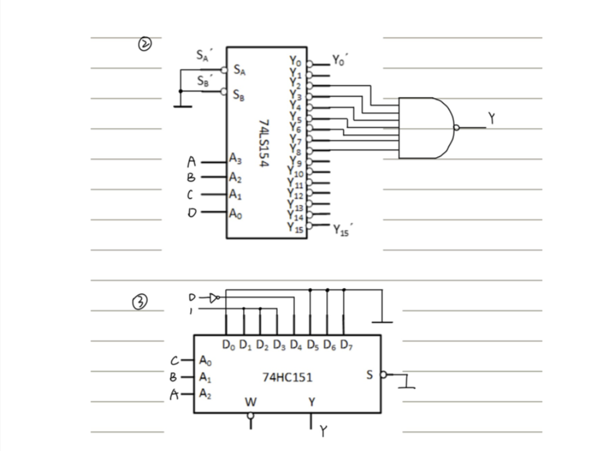

# 数字逻辑

+ 编码器：数字编成二进制编码

  

+ 译码器：二进制编码解码为数字

+ 数字选择器

+ 计数器

# 最前 一定一定要写器件名

## 第一章

### 逻辑门器件

### 逻辑公式

## 组合逻辑电路分析功能(通过真值表)

## 第四章

## 第六章

### 题型一 时序逻辑分析

#### 注意事项

#### 例题一

**作答：**

#### 例题二

#### 例题三

### 题型二 设计时序逻辑电路

#### 例题一 触发器设计计数器

#### 注意事项：

> 计数器的进位输出Y不一定是原来的Rco，要根据电路的设计来分析进位输出
>
> 

**题目：**

##### 方法一

##### 方法二

#### 例题二 计数器设计计数器

#### 例题一

> 进位输出Y的取值，对于异步置零来讲，输出不能放到与非门的的输出那一根线上，因为严格来讲那根线其实是在过渡态才会有信号输出，不是计数器本来的进制数
>
> 而如果是同步置数法就可以用这根线的状态来书橱进位

#### ***<u>例题二</u>***

#### <u>*例题三*</u>

> 你看看他的C与下一片计数器EP,ET的关系
>
> 异步最后的那个加一其实是没加000这个状态补上才有的

### 题型三 节拍脉冲发生器

### 题型四 序列信号发生器

## RAM存储容量

## 第七章题型

### 开机延迟电路

**答案：**

### 施密特电路

### 单稳态电路

## 第八章

### 题型一

**答案：**

### 题型二

**答案：**

> -5.01V

### 题型三

