# 数据结构

## 时间复杂度

### 推导大O阶时间复杂度方法

从算法中选取一种对于所研究的问题来说是基本操作的原操作；以该基本操作在算法中重复执行的次数作为算法运行时间的衡量标准。

(1)用常数1取代运行时间中的所有加法常数；

(2)在(1)结果中，只保留最高阶项；

(3)最高阶项如果存在，且不是1,则去除与该

最高项相乘的常数，所得结果就是大O阶。

**例题：**

```c
// 时间复杂度？
for(i =0; i<m; i++) {
    a = a + 1;
    for(j = 1; j <=m; j = j*2)
        b = a + b ;
} 
```

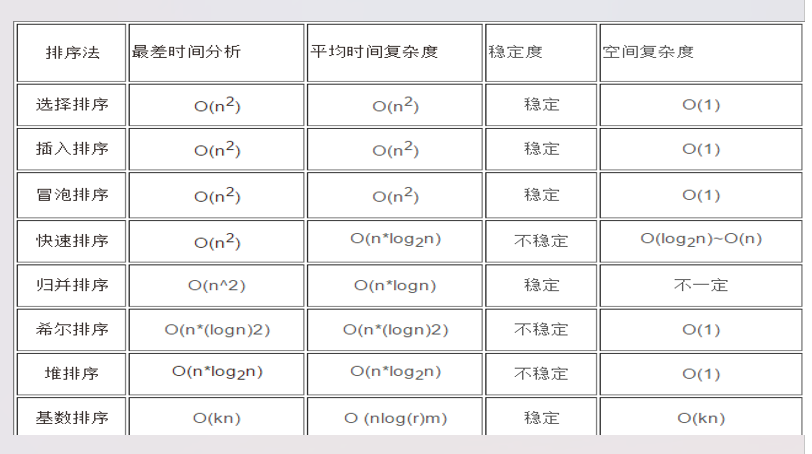

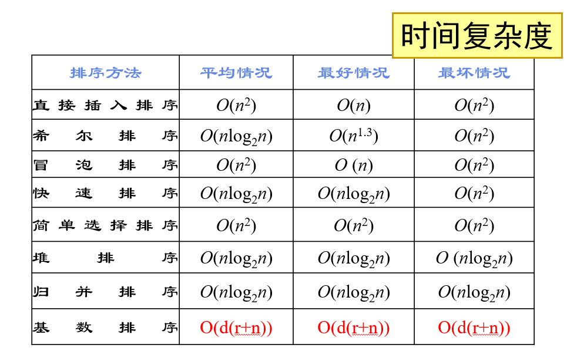

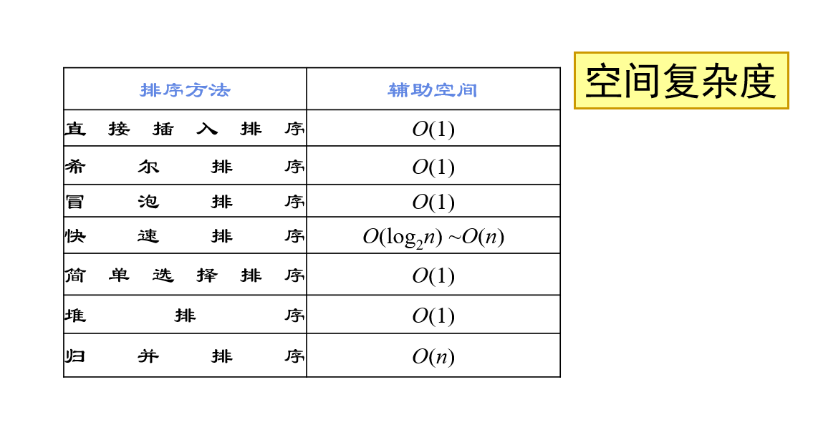

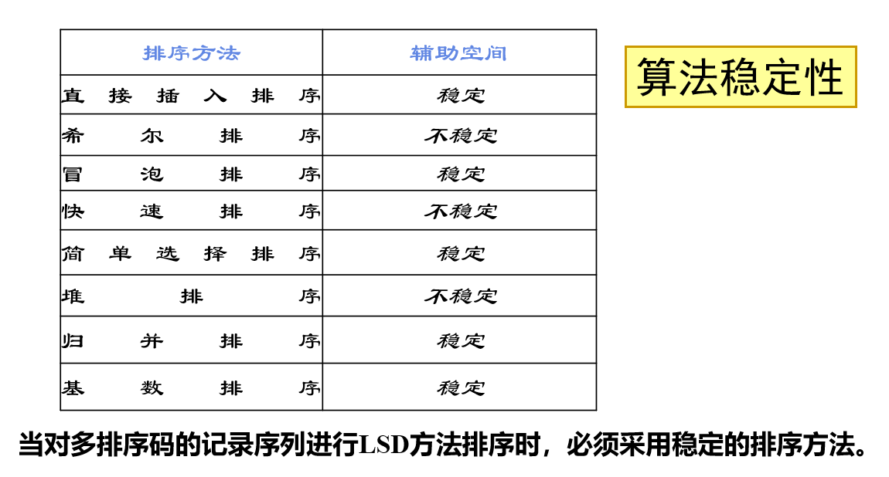


## 树

### 二叉树的性质

根为第0层

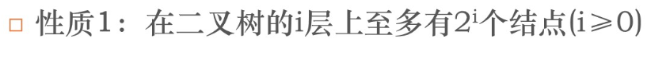

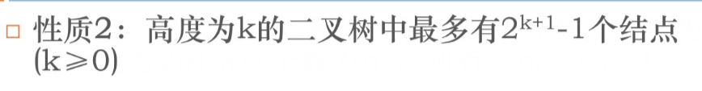

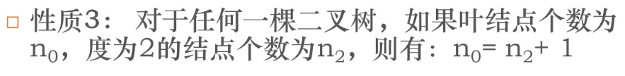


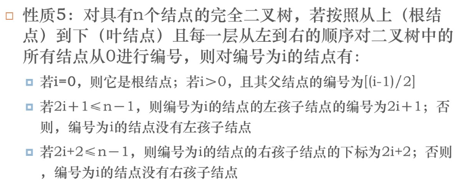

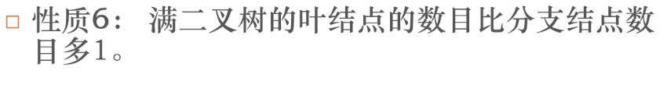


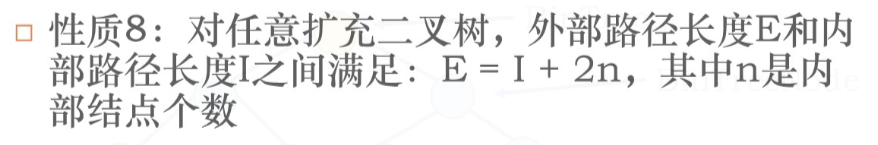

### 二叉树的存储结构

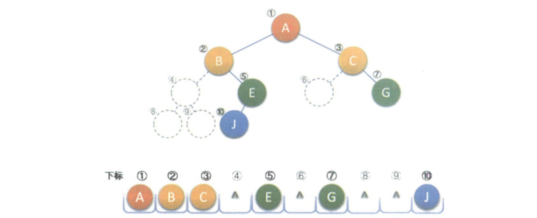

### 计算二叉树的高度深度层数


### 二叉排序树

二叉排序树（Binary Search Tree，BST）是一种特殊的二叉树，它具有以下性质：

1. **节点结构：** 每个节点最多有两个子节点，分别称为左子节点和右子节点。
2. **节点值大小关系：** 对于树中的任意节点，其左子树中的所有节点值都小于它，而右子树中的所有节点值都大于它。
3. **中序遍历有序：** 对二叉排序树进行中序遍历会得到一个有序的序列。

#### 根据遍历顺序生成二叉树

##### 前序和中序


##### 后序和中序


##### 前序和后序

> 这道题和前两道题有一个本质的区别：
>
> **通过前序中序，或者后序中序遍历结果可以确定唯一一棵原始二叉树，但是通过前序后序遍历结果无法确定唯一的原始二叉树**。

### 扩充二叉树

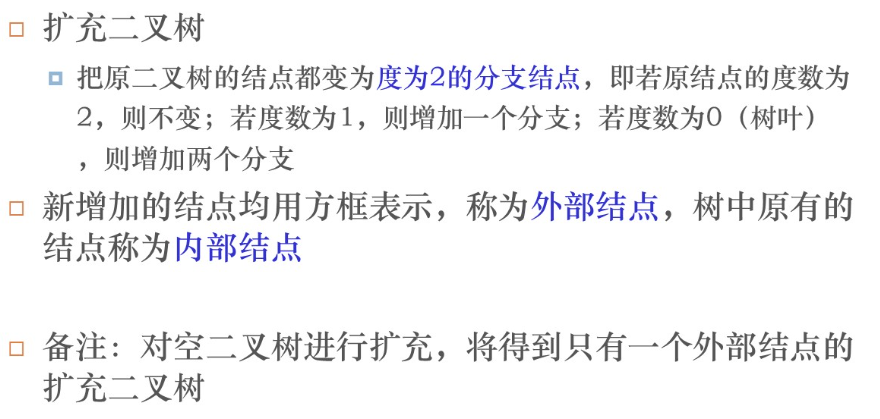


### 森林

#### 森林转化为二叉树

##### 长子兄弟法

左孩子右兄弟


### 哈夫曼树


### 线索二叉树

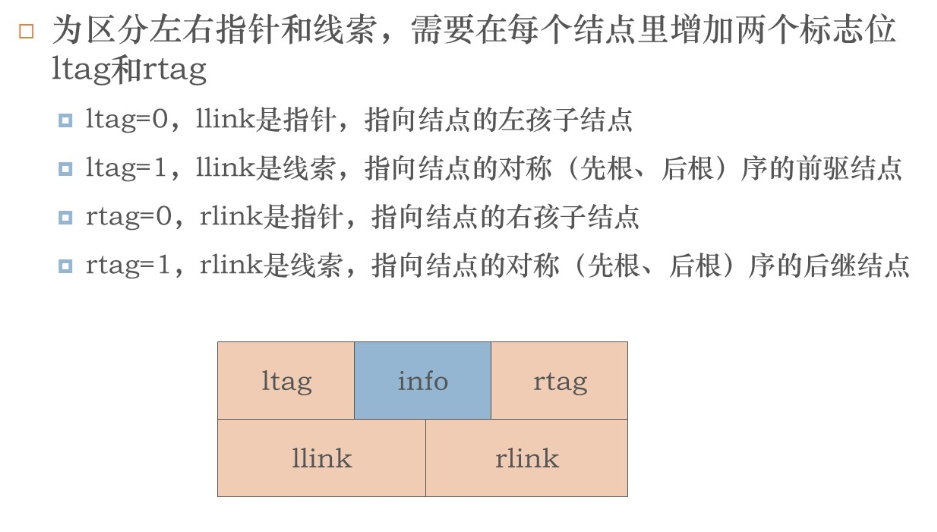

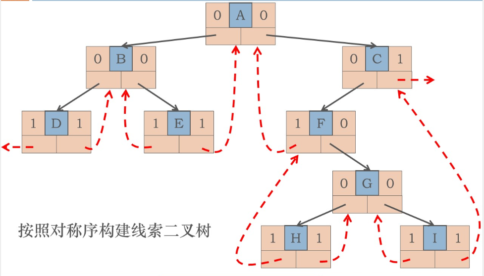


## 查找

### 字典

> ¤碰撞： 若key1≠key2，但h(key1)=h(key2）
>
> ¤同义词：发生碰撞的两个（或多个）关键码
>
> ¤基本区域：散列函数h的值域，即可以使用的整个地址空间
>
> ¤溢出区：为解决碰撞等问题为引入的基本区域以外的存储区
>
> ¤散列表: 采用散列法表示的字典

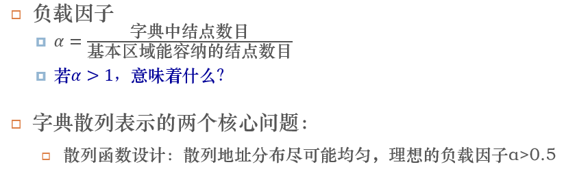

#### 散列函数

除余法

¤基本策略：关键码除以某个不大于关键码的数p后的余数作为散列地址

¤*h*(key) = (int) key % p

¤p一般选素数

n若m = 128, 256, 512, 1024, 则p可取127, 251, 503, 1019


#### 查找成功时的平均查找长度ASL


### 折半查找


## 排序

### 算法稳定性

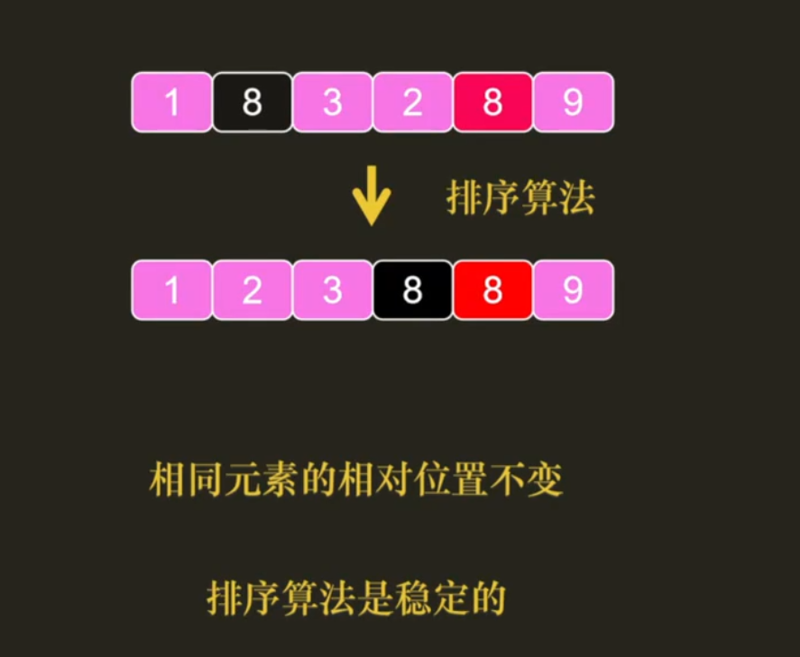

### 总结

1. 各种排序方法各有优缺点，排序算法之间的比较主要考虑以下几个方面：

- 算法的时间复杂度
- 算法的辅助空间与被排序对象的表示方式
- 排序算法的稳定性
- 算法结构的复杂性
- 参加排序的数据的规模 

2. Shell排序、堆排序、快速排序及归并排序的速度较快，其它排序方法的速度较慢；一般情况下，从算法结构的简单性看，速度慢的排序算法比较简单、直接。Shell排序法、快速排序法、堆排序法及归并排序法可以看作是对某一种排序方法的改进，算法结构比较复杂

3. 当数据规模n较小时，则采用简单的排序方法比较合适，如直接插入排序或直接选择排序等。由于直接插入排序法所需记录的移动较多，当空间的要求比较容易满足时，可以采用表插入排序法减少记录的移动

当文件的初态已基本有序时，可选择简单的排序方法，如直接插入排序或起泡排序

当数据规模n较大时，应选用速度快的排序算法，其中快速排序法最快，被认为是目前基于比较的排序方法中最好的方法。当待排序的记录是随机分布时，快速排序的平均时间最短。但快速排序有可能出现最坏情况，这时快速排序算法的时间复杂度为O(n2)，且递归深度为n，即所需栈空间为O(n)

堆排序不会出现象快速排序那样的最坏情况，且堆排序所需的辅助空间比快速排序少。这两种算法都是不稳定的，如果要求排序是稳定的，则可以选择归并排序方法

基数排序法所需的辅助空间较大，但其时间复杂度可简化成O(d*n)；当排序码的位数d较少时，可进一步简化成O(n)，能达到较快的速度。当n较大，记录的排序码位数较少且可以均匀分解时，采用基数排序方法较好

归并排序法可以用于内排序，也可以用于外排序

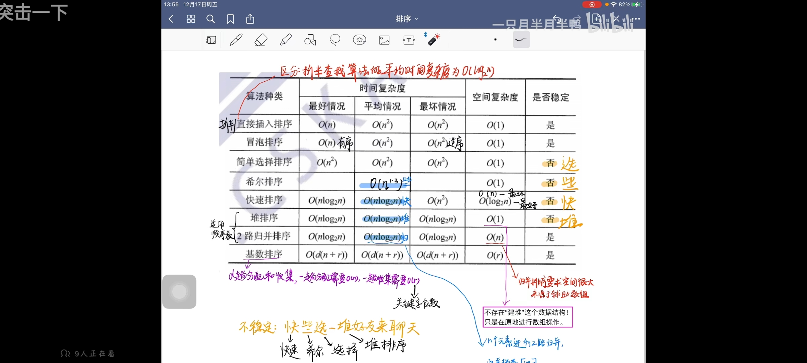


### 二分插入排序

#### 概述

> 二分插入排序是插入排序的一种变体，与常规插入排序相比，在找到插入位置时使用了二分查找。这意味着在已排序的部分列表中使用二分搜索来确定要插入的元素的正确位置，而不是顺序地逐个比较。

#### 算法步骤

1. **初始状态**：将第一个元素视为已排序的子列表。
2. **遍历未排序列表**：从第二个元素开始，逐个遍历未排序的元素。
3. **二分查找**：对于每个要插入的元素，使用二分查找在已排序的子列表中找到合适的位置。
4. **插入元素**：将元素插入到找到的位置，移动其他元素以便为新元素腾出空间。
5. **重复**：重复以上步骤直到所有元素都被放置到已排序列表中。

#### 代码：

```c++
/**
 * 二分插入排序算法
 * 
 * @param arr 要排序的整数数组
 * @param n 数组的大小
 */
void binaryInsertionSort(int arr[], int n) {
    for (int i = 1; i < n; i++) {
        int key = arr[i];
        int left = 0, right = i - 1;

        // 使用二分查找找到插入位置
        while (left <= right) {
            int mid = left + (right - left) / 2;
            if (arr[mid] < key)
                left = mid + 1;
            else
                right = mid - 1;
        }

        // 将元素插入到正确位置
        for (int j = i - 1; j >= left; j++) {
            arr[j + 1] = arr[j];
        }
        // 如果要插入的位置还是原来的位置，就不进行插入操作
        if(left!=i)
	        arr[left] = key;
    }
}

```

#### 时间复杂度

- 最坏情况下的时间复杂度为 O(n^2)。虽然平均情况下仍然是 O(n^2)，但由于使用了二分查找，相比常规插入排序在某些情况下能更快地运行。

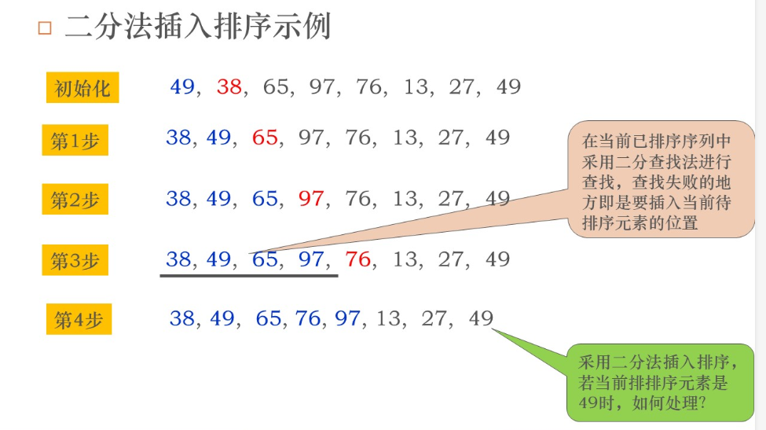

### 表插入排序

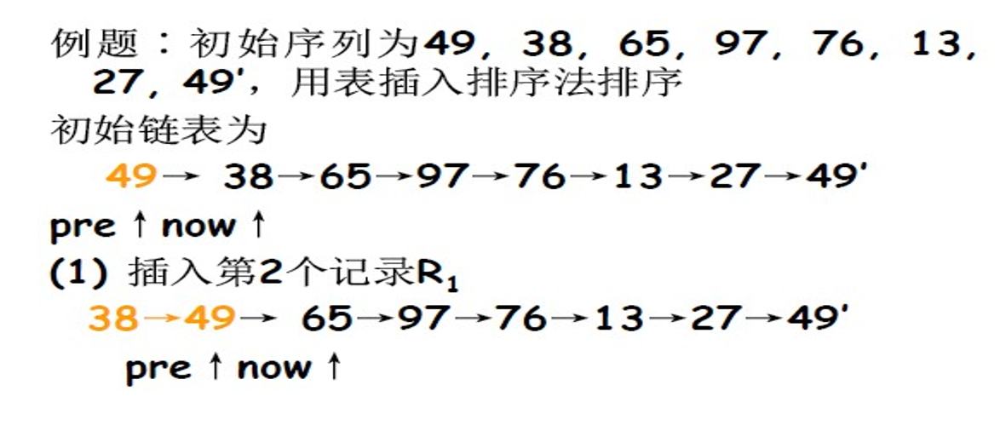

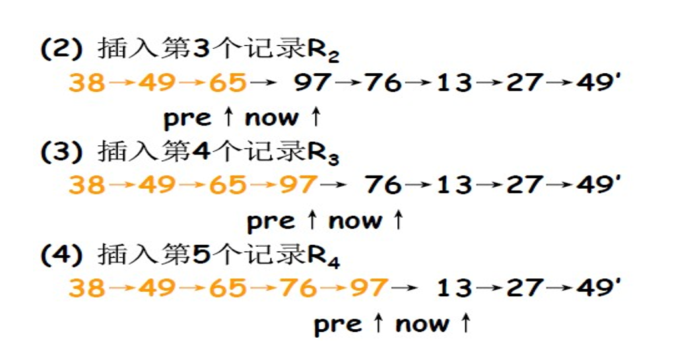

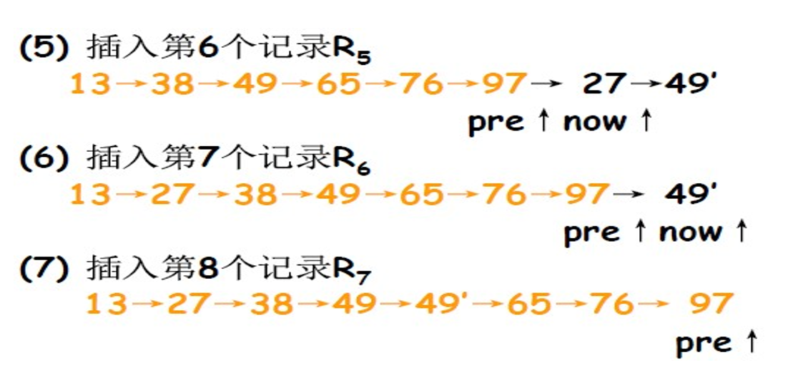


### 直接选择排序

#### 算法步骤

首先在未排序序列中找到最小（大）元素，存放到排序序列的起始位置。

再从剩余未排序元素中继续寻找最小（大）元素，然后放到已排序序列的末尾。

重复第二步，直到所有元素均排序完毕。

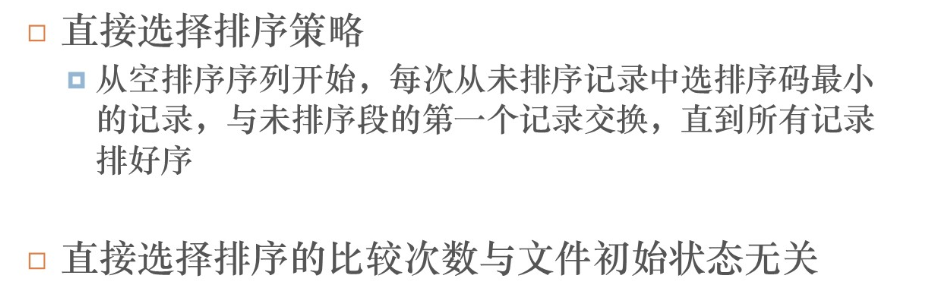


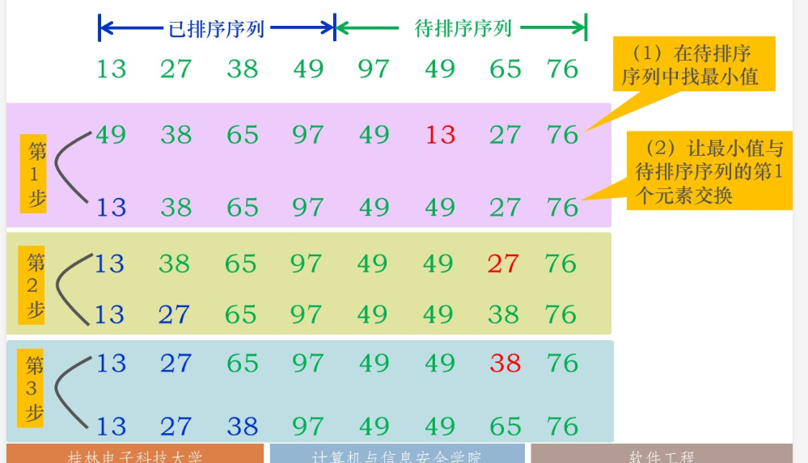

### 直接插入排序

#### 算法步骤

- **开始**：设立一个指针 `i` 指向第二个元素，此时第一个元素被视为已排序序列。
- **插入操作**：从第二个元素开始，将当前元素与已排序序列从后向前逐个比较。如果当前元素小于已排序序列中的某个元素，就将该元素向后移动一位。
- **找到位置**：直到找到当前元素应该插入的位置，然后将当前元素插入到这个位置。
- **重复操作**：重复以上步骤直到遍历完所有元素。


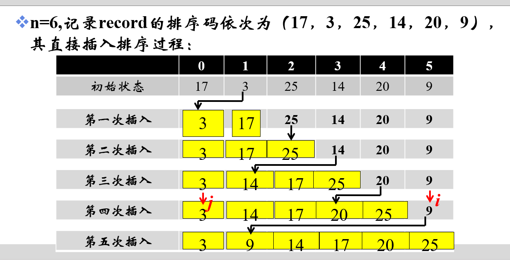


### 希尔排序

#### 概述

> 希尔排序（Shell Sort）是一种排序算法，它是直接插入排序的改进版本，通过将待排序的数据元素按照一定的间隔分组，对每组使用直接插入排序算法进行排序，最终使整个序列基本有序。这个间隔称为增量序列，通常取值为 n/2、n/4、...、1（n 为待排序序列的长度）。

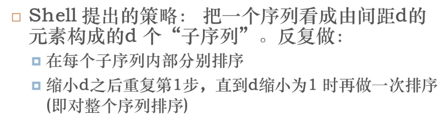

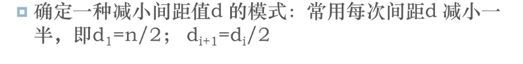

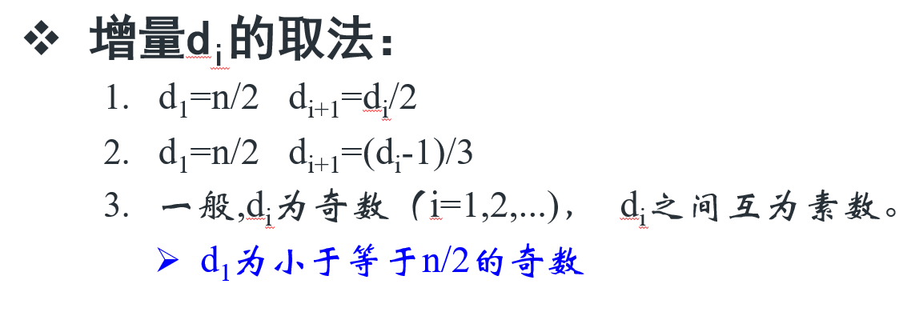

#### 算法步骤

1. **选择增量序列：** 选择一个增量序列用于分组。
2. **分组：** 将序列按照当前增量分成若干个子序列。
3. **对每个子序列进行插入排序：** 对每个子序列使用插入排序算法进行排序。
4. **逐渐缩小增量：** 缩小增量，重复上述步骤直至增量为1。

#### 代码：

```c++
/**
 * @brief 希尔排序算法
 * @param arr 待排序的整数数组
 * @param n 数组的长度
 * 
 * 希尔排序通过使用不同的增量对子序列进行插入排序来排序整个数组。
 * 使用希尔排序对传入的整数数组进行排序，不返回值。
 */
void shellSort(int arr[], int n) {
    // 选择增量序列，通常取 n/2、n/4、...、1
    for (int gap = n / 2; gap > 0; gap /= 2) {
        // 对每个子序列进行插入排序
        for (int i = gap; i < n; i++) {
            int temp = arr[i];
            int j;
            // 对每个子序列使用插入排序算法
            for (j = i - gap; j >= 0 && arr[j] > temp; j -= gap) {
                arr[j+gap] = arr[j];
            }
            arr[j+gap] = temp;
        }
    }
}
```

#### 时间复杂度

- 希尔排序是插入排序的改进版，通过分组减少插入排序的工作量。
- 核心在于选择合适的增量序列。
- 具有不稳定性，相同元素的前后顺序在排序后可能会改变。

希尔排序的时间复杂度与所选取的间隔序列有关，一般情况下，其时间复杂度在最坏情况下为 O(n^2)，但在大多数情况下要好于简单插入排序。如果使用更优的间隔序列，希尔排序的性能可能会更好。

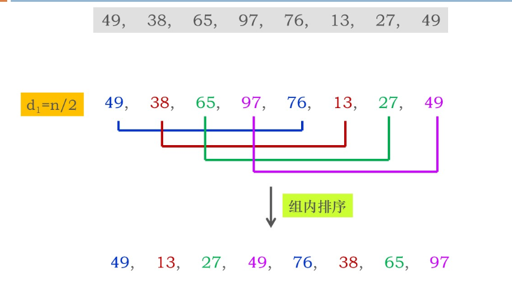

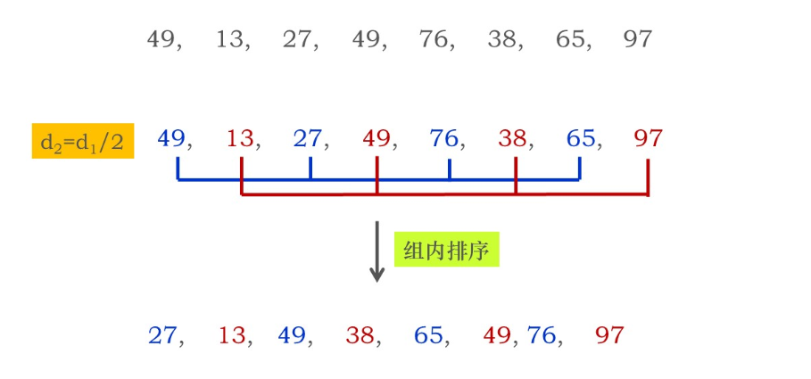

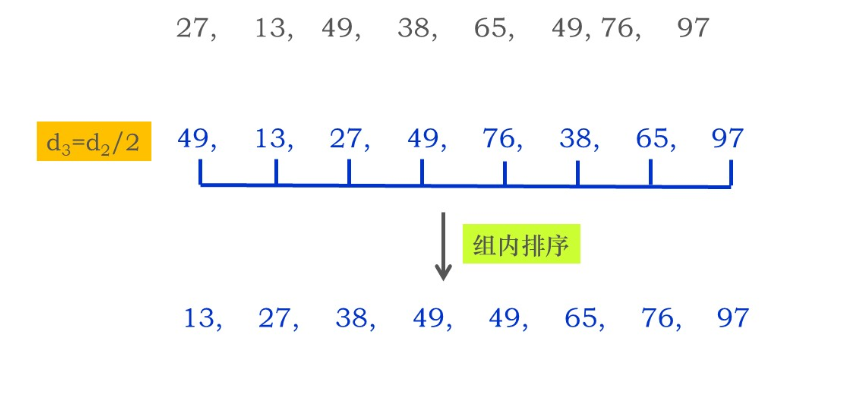


### 堆排序

#### 概述

> 堆排序（Heap Sort）是一种高效的排序算法，利用堆这种数据结构来实现。它具有稳定的时间复杂度，并且是原地排序算法，不需要额外的空间。

#### 算法步骤

堆排序是一种基于完全二叉树的排序方法，它分为两个阶段：构建堆和堆的调整。

##### 1. 构建堆（Heapify）

- **构建最大堆（Max Heap）或最小堆（Min Heap）**：根据排序需求，最大堆要求父节点的值大于其子节点，最小堆则相反。在堆排序中，一般使用最大堆来实现升序排序。
- **从最后一个非叶子节点开始**：最后一个非叶子节点的索引为 `n/2-1`，其中 `n` 是堆的大小。从最后一个非叶子节点开始，依次向前构建堆。
- **堆调整（Heapify）**：检查父节点与其子节点，确保父节点的值比子节点大（最大堆）或小（最小堆）。如果不满足堆的性质，则交换节点值，继续向下调整堆。

##### 2. 堆的调整（Heap Sort）

- **将堆顶元素与末尾元素交换**：在最大堆中，堆顶元素是最大值。将堆顶元素与数组末尾元素交换，将最大值放置在正确的位置。
- **减小堆的大小**：排除已排序的末尾元素，减小堆的大小，再次调整堆，恢复堆的性质。
- **重复交换和调整**：重复以上步骤直到整个数组有序。

#### 代码

```c++
/**
 * @brief 交换两个整数的值
 * @param a 第一个整数
 * @param b 第二个整数
 */
void swap(int &a, int &b) {
    int temp = a;
    a = b;
    b = temp;
}

/**
 * @brief 从给定的节点开始构建最大堆
 * @param arr 待排序的数组
 * @param n 数组的大小
 * @param i 当前节点的索引
 */
void heapify(int arr[], int n, int i) {
    int largest = i;    // 初始化父节点索引为最大值
    int left = 2 * i + 1;   // 左子节点索引
    int right = 2 * i + 2;  // 右子节点索引

    // 如果左子节点比父节点大，则更新最大值索引
    if (left < n && arr[left] > arr[largest])
        largest = left;

    // 如果右子节点比父节点大，则更新最大值索引
    if (right < n && arr[right] > arr[largest])
        largest = right;

    // 如果最大值不是父节点，则交换父节点与最大值节点，并继续递归调整堆
    if (largest != i) {
        swap(arr[i], arr[largest]);
        heapify(arr, n, largest);
    }
}

/**
 * @brief 执行堆排序
 * @param arr 待排序的数组
 * @param n 数组的大小
 */
void heapSort(int arr[], int n) {
    // 构建最大堆，从最后一个非叶子节点开始
    for (int i = n / 2 - 1; i >= 0; i--)
        heapify(arr, n, i);

    // 依次提取最大值，不断调整堆
    for (int i = n - 1; i > 0; i--) {
        // 交换堆顶（最大值）与当前末尾元素
        swap(arr[0], arr[i]);

        // 重新调整堆
        heapify(arr, i, 0);
    }
}
```

#### 算法复杂度

- **时间复杂度**：堆排序的时间复杂度为 O(n log n)，其中 `n` 是元素数量。
- **空间复杂度**：堆排序是原地排序，只需要常数级别的额外空间。

#### 优缺点

- **优点**：堆排序适用于大规模数据，具有稳定的时间复杂度，且是原地排序算法。
- **缺点**：相对于快速排序，实现稍复杂，且对于小规模数据性能略低。

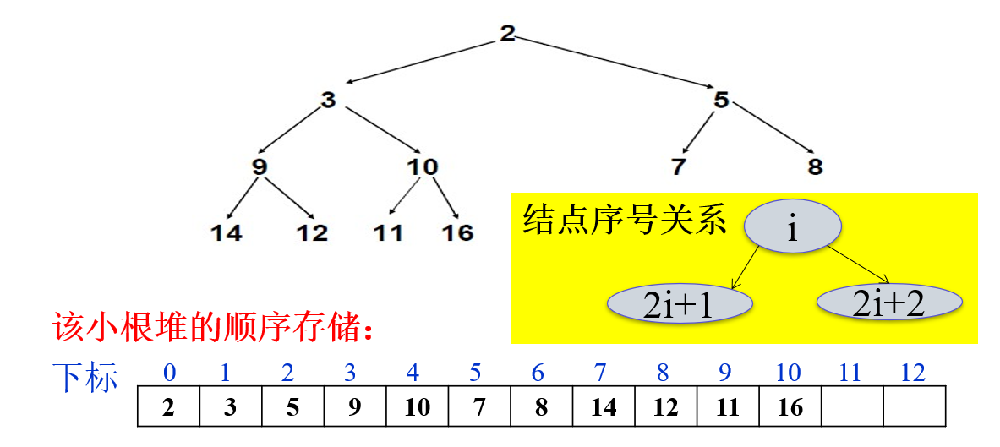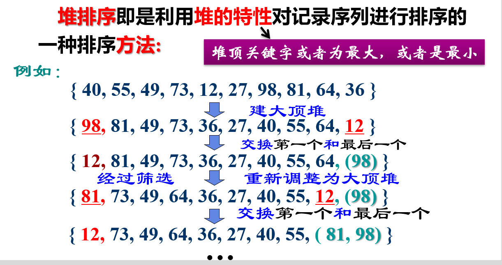


### 冒泡排序

####  算法步骤

比较相邻的元素。如果第一个比第二个大，就交换他们两个。

对每一对相邻元素作同样的工作，从开始第一对到结尾的最后一对。这步做完后，最后的元素会是最大的数。

针对所有的元素重复以上的步骤，除了最后一个。

持续每次对越来越少的元素重复上面的步骤，直到没有任何一对数字需要比较。


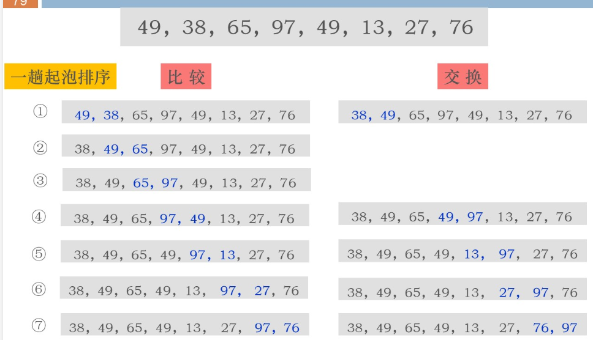

### 快速排序


### 基数排序

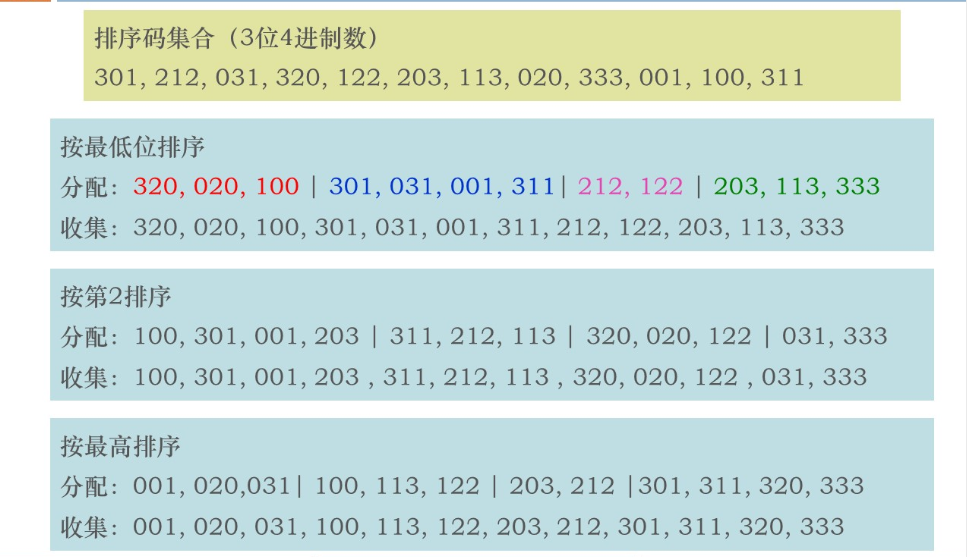

### 归并排序

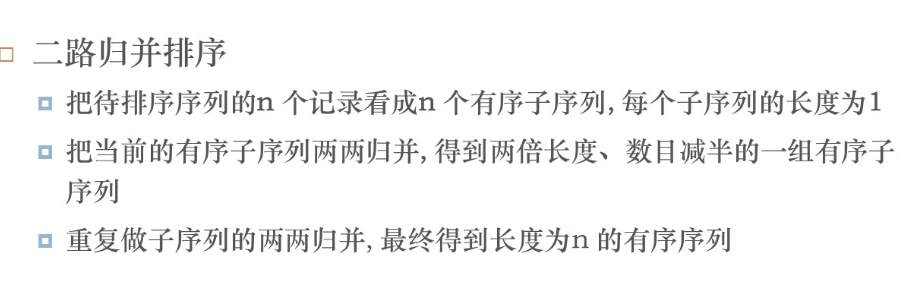

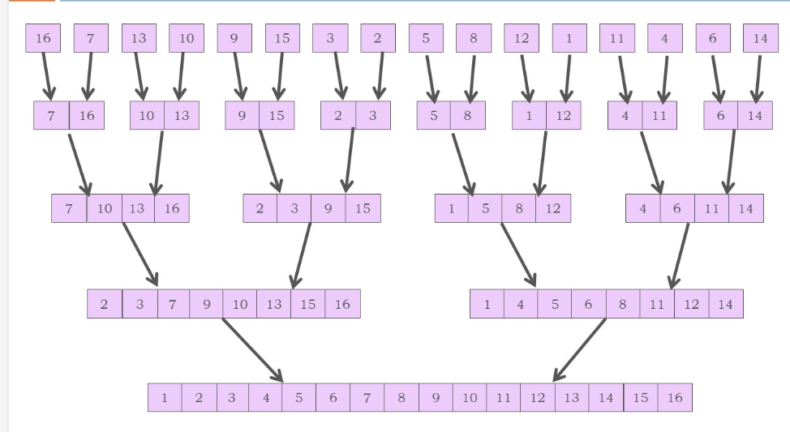

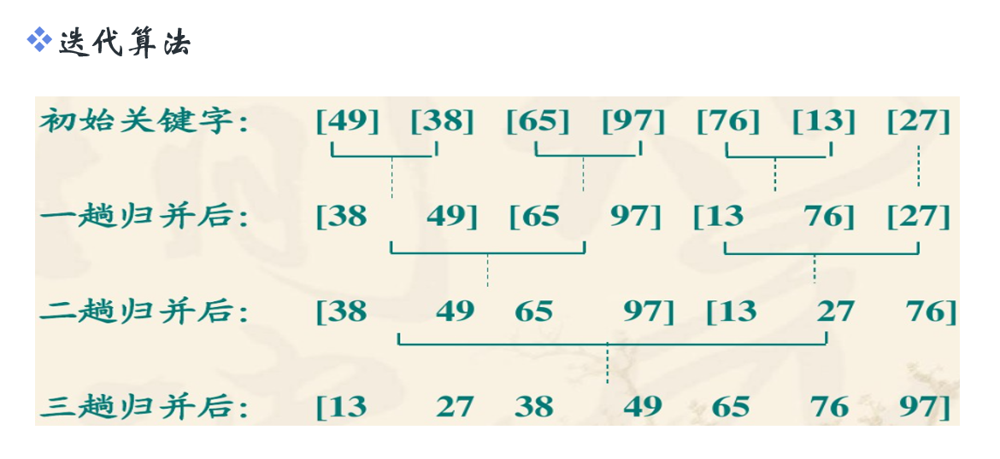


## 图

¨完全图：任意两个顶点之间都有边的有向图（或无向图） 

¤n 个顶点的无向完全图有n*(n-1)/2 条边

¤n 个顶点的有向完全图有n*(n-1) 条边

## 最小生成树

### Prim算法

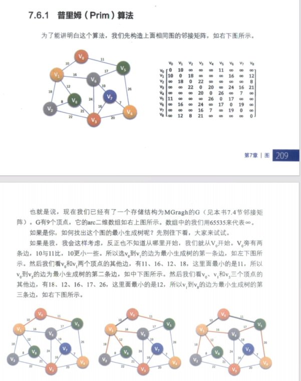

### 克鲁斯卡尔算法

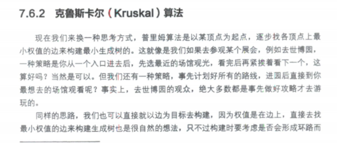

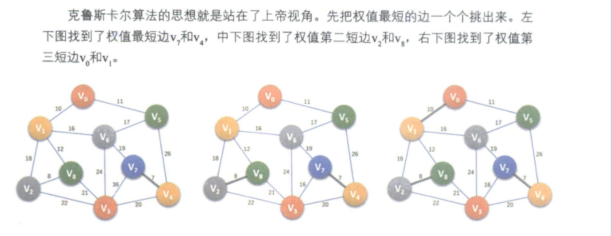

## 最短路径

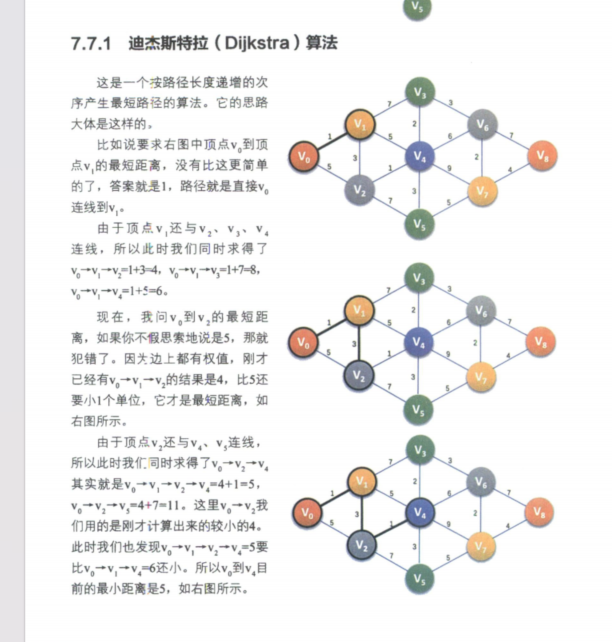


