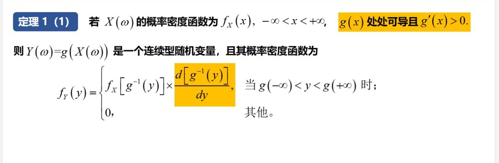

# 概率论

## 第一章

### 基本概念

两两不相容事件：一组事件，其中任何两个事件不能同时发生。换句话说，如果一个事件发生了，那么其他事件就不能同时发生。这些事件是互斥的。

完备事件组：完备事件组是指一组事件，它们在某个特定的随机试验中覆盖了所有可能的结果，并且这些事件两两互斥（不可能同时发生）。换句话说，这些事件中的一个一定会发生，且所有这些事件的并集构成了整个样本空间。

> 举例来说，假设我们考虑掷一个骰子的情况。在这种情况下，掷骰子的结果有可能是 1、2、3、4、5 或 6。如果我们定义如下的事件：
>
> - 事件 A：骰子的结果为偶数（2、4 或 6）
> - 事件 B：骰子的结果为奇数（1、3 或 5）
>
> 在这个例子中，事件 A 和事件 B 互斥（不可能同时发生），并且它们的并集覆盖了所有可能的骰子结果（1 到 6）。因此，事件 A 和事件 B 构成了一个完备事件组，因为其中一个事件一定会发生，并且它们两两互斥。

相互独立：

随机变量：

独立同分布：当多个随机变量同时满足独立性和同分布性时，就称这些随机变量是独立同分布的。这意味着它们彼此之间是独立的，并且都是从相同的概率分布中获取的。

### 集合运算律

不要只看公式，也可以想想Ven图，结合起来思考。

这个公式是双向的，双向你都要想起来这个公式

$$A-B=A\bigcap\overline{B}$$

全概率公式：

##### 例题：

##### 例题：

知识点：加法公式

##### 例题：

**知识点：**全概率公式

### 排列组合：

+ 排列：排列是指从一组对象中按照一定顺序选取一部分或全部对象的方式。对于给定的 n 个对象中取出 r 个进行排列的方式数

+ 组合：组合是指从一组对象中选择一部分对象，而不考虑对象的顺序。对于给定的 n 个对象中取出 r 个进行组合的方式数

  > P本质上是取法的比值

**例题：**

**例题：**

**例题：**

**例题：**

> 我不会表示串联和并联

## 第二章

### 知识点：

**分布函数：**

> X落在某一区间的概率

**分布函数的性质：**

##### 例题：

### 连续型随机变量

##### 例题：

知识点：求解分布函数

### 正态分布

