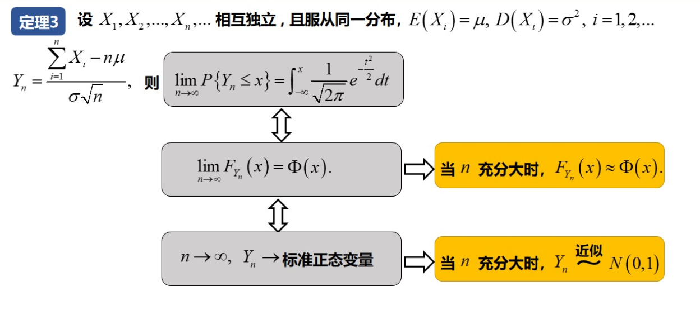

# 概率论做题

## 第二章

### 2.4 连续型随机变量

**例题：**

### 2.5 随机变量函数的分布

## 第三章 

### 联合概率分布(二维随机向量)

#### 离散型

#### 连续型

**例题：**

### 3.2 条件分布与独立性

**例题：**

### 3.3 二维随机向量函数的分布

#### 离散型

**标准正态分布**

**例题：**

#### 连续型

**例题：**

## 第四章

### 数学期望

$E(X-C)=E(X)-C$

### 方差

### 协方差

> 如果两个随机变量独立，它们的协方差一定为零；但是，如果两个随机变量的协方差为零，并不能推断它们一定是独立的，因为它们可能存在其他类型的相关性，如非线性相关性。

**例题：**

### 大数定律与中心极限定理(切比雪夫)

#### 大数定理

#### 切比雪夫

**例题：**

**区分：**

#### 中心极限定理

**例题：**

## 第五章

### 5.2统计量

### 5.3 常用统计分布

#### 置信区间

### 分位数

水平为1-a的上侧分位数=-其水平为a的上侧分位数

$F(1-a)=-F(a)$

#### $X^2$分布

#### $t$分布

#### $F$分布

#### 总结：

## 第六章

> 估计就是用样本来估计总体

1. **总体均值（Population Mean）：** 总体均值指的是整个总体中所有个体数值的平均值。在统计学中，总体是指研究对象的全部集合，而总体均值是对整个总体进行统计量化的一个指标。然而，通常情况下我们无法直接获得总体的全部数据，因此必须通过样本来估计总体参数。
2. **样本均值（Sample Mean）：** 样本均值指的是从总体中选取的一部分数据，也就是样本，所得到的平均值。样本是从总体中选取的一小部分，以代表总体的特征。样本均值通常用来估计总体均值，因为它是从总体中获得的数据的一个近似。

### 点估计

#### 常用方法

### 矩估计

根据大数定理，当n->无穷大时，中心距趋近于总体

**例题：**

### 最大似然估计

第三步

求出驻点

**例题：**

### 置信区间(区间估计)

**置信区间与置信度和样本容量之间的关系**

**求解步骤：**

**例题：**

> ==不用算枢轴变量，只用算置信区间就行==

**单正态：**

**双正态主体：**

## 第七章

### 假设检验

> ==这个要算枢轴变量，因为要通过判断枢轴变量枢轴变量是否在拒绝域范围内来判断假设是否成立。==

## 补充

> 如果题目给你说了X服从正态分布，并且问你PX的范围，要化为标准正态分布来求

模拟测试1

1.A

2.协方差

3.切比雪夫，其实不是:cry:,看错了，不一样，应该是正态分布的性质

6.相关系数

7.中心极限定理

不熟悉求解置信区间和判断假设H0的过程

11（1）

模拟测试2

3.还是不熟悉cov的性质

4.一看到，我人就傻了，不会了，看不懂了，啥玩意？说明还是理解不够深

7.切比雪夫好难记:cry:，

！！！！切比雪夫计算出来的值是0.11，理论上从图上来看，就是切比雪夫所计算的区域是两边，把式子展开看看是不是两边就知道了

9.写着写着全概率公式记错了，第一题就败北了:cry:

10.不是很熟悉，要多做

第11关的(2)的计算的过程不熟悉，有问题，你自己看看

第12题不独立，联合概率密度要看是不是互相独立

14题一开始我不知道到底要计算什么，知道我发现可以通过题目给的“注”给的分布数值，发现是t分布，即均值

模拟测试三

11、求F(2,3)

